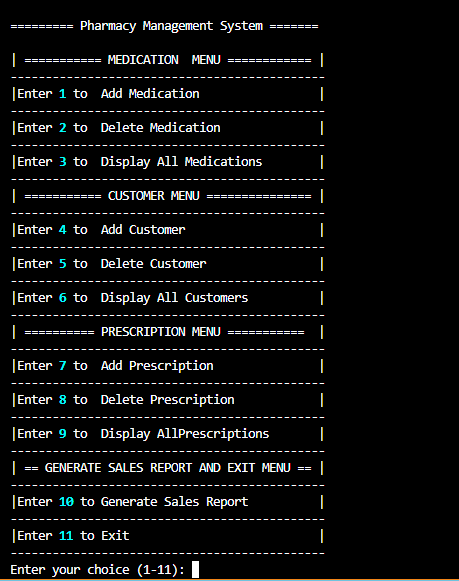
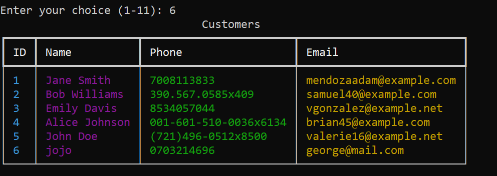
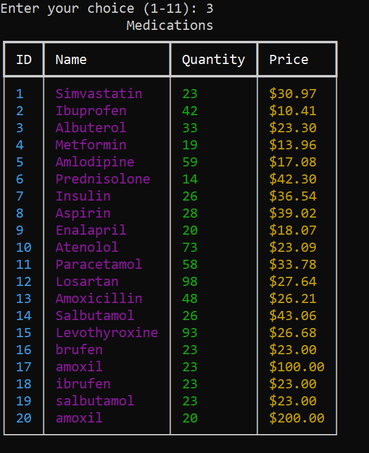
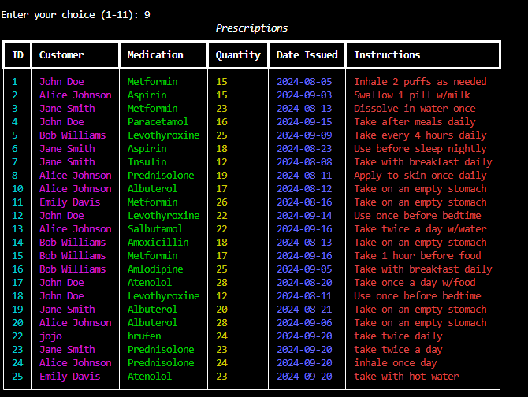

# Pharmacy Inventory System Management

Welcome to the **Pharmacy Inventory System Management** project! This Python project utilizes Object-Oriented Programming (OOP) and SQLAlchemy to manage the operations of a pharmacy, focusing on customers, medications, and prescriptions.

#### By **George Badia**

This project is the sole property of George Badia.

## Screenshots

### Menu



### Customers



### Medications



### Prescription



## Project Overview

The **Pharmacy Inventory System Management** project models a system that tracks medications, customer details, and prescriptions using three core classes:

- **Customer**: Represents a customer who can receive prescriptions.
- **Medication**: Represents the medications available at the pharmacy.
- **Prescription**: Represents a prescription given to a customer for a specific medication.

### The project also simulates relationships between these entities:

- A customer can have multiple prescriptions.
- A medication can be prescribed in many different prescriptions.
- Each prescription is linked to one customer and one medication.

## Features

- **Customer Management**: Create and manage customer profiles, including their contact information.
- **Medication Management**: Keep track of medications, their prices, descriptions, and stock quantities.
- **Prescription System**: Assign prescriptions to customers, specifying the medication, quantity, and instructions for use.
- **Data Aggregation**: Retrieve a list of prescriptions for each customer, and track the most prescribed medications.
- **Test Coverage**: All methods and classes are tested using Pytest to ensure proper functionality.

## Further Explanations:

- **add_medication:** Adds a new medication to the inventory. Prompts the user for details and performs input validation for price and quantity.

- **delete_medication:** Deletes a medication by ID after validating the input.

- **display_medications:** Fetches all medications and displays them in a table format.

- **add_customer:** Adds a new customer, validating the phone number for the correct format.

- **delete_customer:** Deletes a customer by their ID after validation.

- **display_customers:** Displays a table of all customers with their details.

- **add_prescription:** Adds a new prescription for a customer with input validation for quantity and IDs.

- **delete_prescription:** Deletes a prescription by its ID.

- **display_prescriptions:** Fetches all prescriptions and displays them in a detailed table.

- **generate_sales_report:** Calculates and displays a sales report based on prescriptions.

- **run:** Main loop for the CLI menu, handling user input and invoking the corresponding methods.

## Setup/Installation Requirements

- Linux or WSL for Windows users
- Visual Studio Code installed
- GitHub account
- Python 3.x
- SQLite Database

## Setup Instructions

1. Clone the repository:
   ```bash
   git clone https://github.com/george-badia/pharmacy-inventory-system
   ```
2. Navigate to the project directory:
   ```bash
   cd pharmacy-inventory-system
   ```
3. Open the project in Visual Studio Code:
   ```bash
   $ code .
   ```

## Running the Application

1. Ensure Python 3.x is installed on your machine.

2. Set Up the Virtual Environment: This project uses `pipenv` for managing dependencies:

   ```bash
   $ pipenv install
   $ pipenv shell
   ```

3. Run database migrations with Alembic:

   ```bash
   $ alembic upgrade head
   ```

4. Run the test cases for validation:

   ```bash
   $ pytest
   ```

5. To run the application, execute the main script:
   ```bash
   $ python3 app/main.py
   ```

## Technologies Used

This project is built with:

- Python 3.x
- SQLAlchemy ORM
- SQLite Database
- Alembic for migrations
- Pytest for testing

## Support and Contact Details

For any issues, feel free to email me at george.otieno1@student.moringaschool.com.

## License

This project is licensed under the MIT License.

- see the [LICENSE](./LICENSE) file for details.
